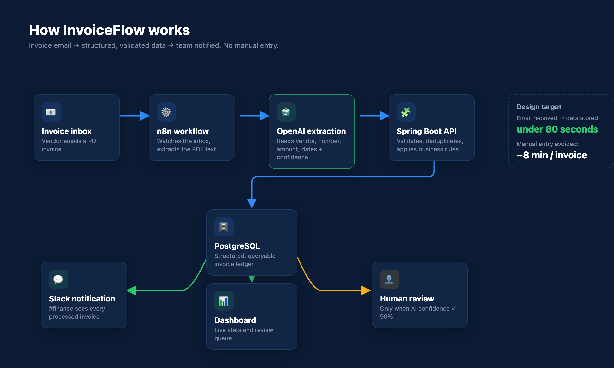
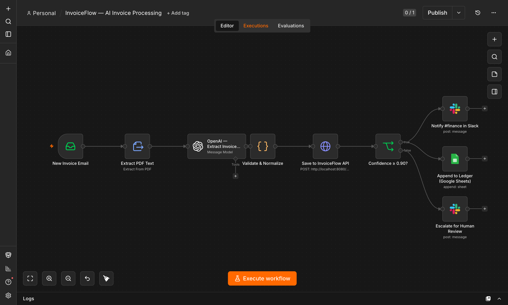
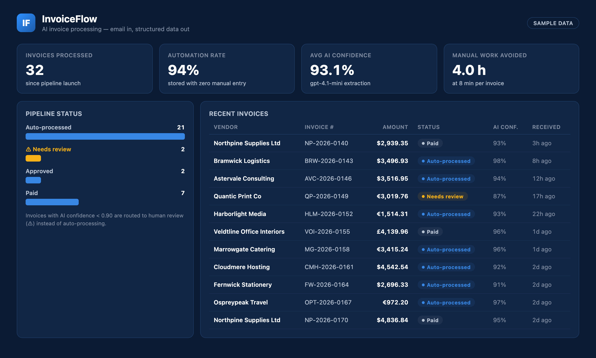
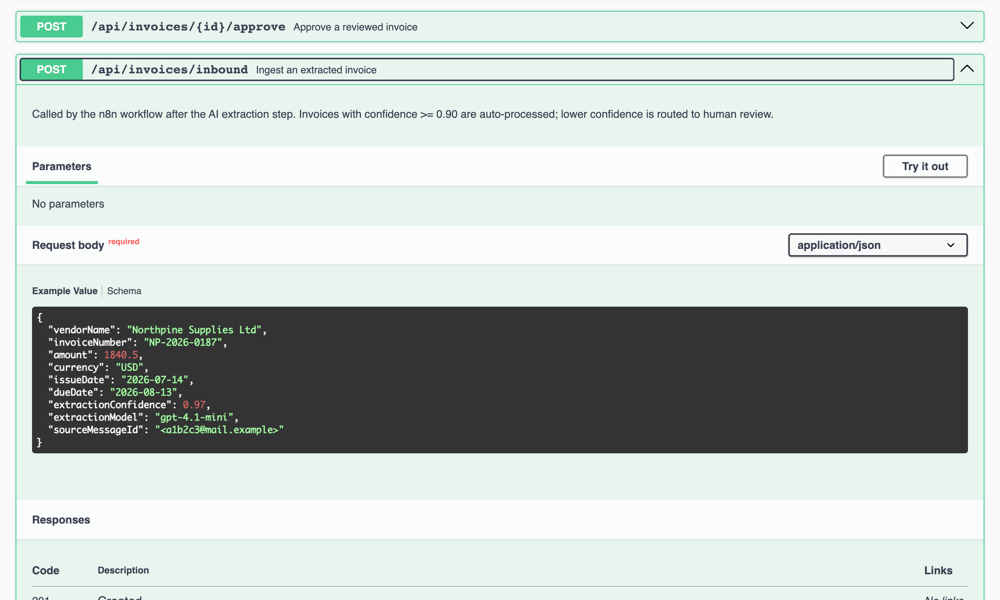

# InvoiceFlow — AI Invoice Processing Automation

Email in, structured data out. An AI-powered invoice pipeline that removes manual data entry from
accounts payable: an **n8n** workflow watches an invoice inbox and extracts the PDF text, an
**OpenAI** model reads the invoice fields with a confidence score, and a **Java Spring Boot**
REST API validates the data, blocks duplicates, and stores structured records.

High-confidence invoices are stored automatically and announced in Slack. Anything below the
90% confidence threshold is routed to a human review queue — automation with a safety net.

> All vendors and invoices in this repository are fictional sample data; credentials are placeholders.

**Stack:** Java 21 · Spring Boot 3 · Spring Data JPA · PostgreSQL/H2 · springdoc-openapi · n8n · OpenAI API · Slack API · Docker-ready

---

## Architecture



```
Invoice inbox → n8n workflow → OpenAI extraction → Spring Boot API → PostgreSQL
                                                          │
                                Slack #finance ◄──────────┤ confidence ≥ 0.90
                                Review queue   ◄──────────┘ confidence < 0.90
```

## The workflow

IMAP trigger → PDF text extraction → OpenAI field extraction → normalization → API call →
confidence gate → Slack notification and ledger append, or escalation to human review.



## The dashboard

Live pipeline statistics: automation rate, average extraction confidence, manual work avoided,
and the review queue.



## The API

Fully documented with OpenAPI/Swagger, including example payloads for every endpoint.



| Method | Path | Purpose |
|---|---|---|
| POST | `/api/invoices/inbound` | Called by n8n after AI extraction |
| GET | `/api/invoices` | List invoices (optional `?status=` filter) |
| GET | `/api/invoices/{id}` | Fetch one invoice |
| POST | `/api/invoices/{id}/approve` | Approve a reviewed invoice |
| GET | `/api/stats` | Dashboard aggregates |

### Confidence routing

The business rule that makes the automation safe lives in `InvoiceService`:

```java
InvoiceStatus status = request.extractionConfidence() >= REVIEW_THRESHOLD
        ? InvoiceStatus.PROCESSED     // stored automatically
        : InvoiceStatus.NEEDS_REVIEW; // routed to a human
```

Duplicate invoice numbers are rejected with `409 CONFLICT` before anything is written.

---

## Running it

### API + dashboard

```bash
./mvnw spring-boot:run
```

- Dashboard: http://localhost:8080/
- Swagger docs: http://localhost:8080/docs
- H2 console: http://localhost:8080/h2-console

The database is seeded with 32 fictional sample invoices at startup.

### n8n workflow

```bash
export N8N_USER_FOLDER=~/.invoiceflow-n8n
npx n8n import:credentials --input=n8n/invoiceflow-credentials.json   # placeholders
npx n8n import:workflow    --input=n8n/invoiceflow-workflow.json
npx n8n
```

Open http://localhost:5678 and select the **InvoiceFlow — AI Invoice Processing** workflow.
Replace the placeholder credentials with real IMAP / OpenAI / Slack / Google accounts to run it live.

---

## Adapting it

The same architecture handles any document-heavy workflow — receipts, purchase orders,
applications, contracts. What changes per use case is the extraction prompt, the target schema,
and the confidence threshold.
